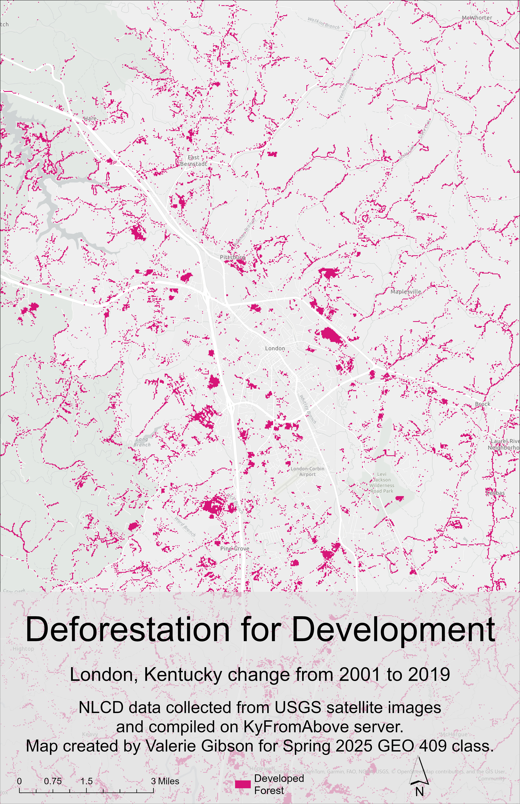

# London, Kentucky Landcover Change

## Forested areas in 2001 that were developed for urban use by 2019

There are many large patches of urban development where there were once trees growing. 
These patches are mainly located along the interstate and near the London-Corbin airport.

  
_A map showing change in forested areas to urban development_

[high-resolution Deforestion for Development](deforestation.pdf)

Map created by Valerie Gibson using the NLCD from USGS, compiled on KyFromAbove public server. 
